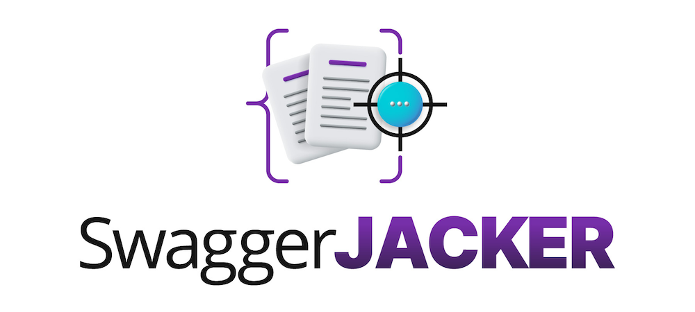

# sj (Swagger Jacker)



sj is a command line tool designed to assist with auditing of exposed Swagger/OpenAPI definition files by checking the associated API endpoints for weak authentication. It also provides command templates for manual vulnerability testing.

It does this by parsing the definition file for paths, parameters, and accepted methods before using the results with one of five sub-commands:
- `automate` - Crafts a series of requests and analyzes the status code of the response.
- `prepare` - Generates a list of commands to use for manual testing.
- `endpoints` - Generates a list of raw API routes. *Path values will not be replaced with test data*.
- `brute` - Sends a series of requests to a target to find operation definitions based on commonly used file paths.
- `convert` - Converts a definition file from v2 to v3.

## Build

To compile from source, ensure you have Go version `>= 1.21` installed and run `go build` from within the repository:

```bash
$ git clone https://github.com/BishopFox/sj.git
$ cd sj/
$ go build .
```

## Install

To install the latest version of the tool, run:

```bash
$ go install github.com/BishopFox/sj@latest

# Note: you may also need to place the path to your Go binaries within your PATH environment variable:
$ export PATH=$PATH:~/go/bin
```

## Usage

> Use the `automate` command to send a series of requests to each defined endpoint and analyze the status code of each response.

```bash
$ sj automate -u https://petstore.swagger.io/v2/swagger.json -q

INFO[0000] Gathering API details.                       
INFO[0000] Sending requests at a rate of 15 requests per second. 

Title: Swagger Petstore
Description: This is a sample server Petstore server.  You can find out more about Swagger at [http://swagger.io](http://swagger.io) or on [irc.freenode.net, #swagger](http://swagger.io/irc/).  For this sample, you can use the api key `special-key` to test the authorization filters.

WARN[0000] Results for https://petstore.swagger.io/v2:  

WARN[0007] Results for http://petstore.swagger.io/v2:   

WARN Manual testing may be required.               Method=POST Status=415 Target=http://petstore.swagger.io/v2/pet
WARN Manual testing may be required.               Method=PUT Status=415 Target=http://petstore.swagger.io/v2/pet
INFO Endpoint accessible!                          Method=GET Status=200 Target=http://petstore.swagger.io/v2/pet/1
WARN Manual testing may be required.               Method=POST Status=415 Target=http://petstore.swagger.io/v2/pet/1
WARN Manual testing may be required.               Method=POST Status=400 Target=http://petstore.swagger.io/v2/pet/1/uploadImage
INFO Endpoint accessible!                          Method=GET Status=200 Target="http://petstore.swagger.io/v2/pet/findByStatus?status=1"
INFO Endpoint accessible!                          Method=GET Status=200 Target="http://petstore.swagger.io/v2/pet/findByTags?tags=1"
INFO Endpoint accessible!                          Method=GET Status=200 Target=http://petstore.swagger.io/v2/store/inventory
WARN Manual testing may be required.               Method=POST Status=415 Target=http://petstore.swagger.io/v2/store/order
ERRO Order not found                               Method=GET Status=404 Target=http://petstore.swagger.io/v2/store/order/1
WARN Manual testing may be required.               Method=POST Status=415 Target=http://petstore.swagger.io/v2/user
WARN Manual testing may be required.               Method=POST Status=415 Target=http://petstore.swagger.io/v2/user/createWithArray
WARN Manual testing may be required.               Method=POST Status=415 Target=http://petstore.swagger.io/v2/user/createWithList
INFO Endpoint accessible!                          Method=GET Status=200 Target=http://petstore.swagger.io/v2/user/login?password=test&username=test
INFO Endpoint accessible!                          Method=GET Status=200 Target=http://petstore.swagger.io/v2/user/logout
INFO Endpoint accessible!                          Method=GET Status=200 Target=http://petstore.swagger.io/v2/user/test
WARN Manual testing may be required.               Method=PUT Status=415 Target=http://petstore.swagger.io/v2/user/test
WARN Manual testing may be required.               Method=POST Status=415 Target=https://petstore.swagger.io/v2/pet
WARN Manual testing may be required.               Method=PUT Status=415 Target=https://petstore.swagger.io/v2/pet
INFO Endpoint accessible!                          Method=GET Status=200 Target=https://petstore.swagger.io/v2/pet/1
WARN Manual testing may be required.               Method=POST Status=415 Target=https://petstore.swagger.io/v2/pet/1
WARN Manual testing may be required.               Method=POST Status=400 Target=https://petstore.swagger.io/v2/pet/1/uploadImage
INFO Endpoint accessible!                          Method=GET Status=200 Target="https://petstore.swagger.io/v2/pet/findByStatus?status=1"
INFO Endpoint accessible!                          Method=GET Status=200 Target="https://petstore.swagger.io/v2/pet/findByTags?tags=1"
INFO Endpoint accessible!                          Method=GET Status=200 Target=https://petstore.swagger.io/v2/store/inventory
WARN Manual testing may be required.               Method=POST Status=415 Target=https://petstore.swagger.io/v2/store/order
ERRO Order not found                               Method=GET Status=404 Target=https://petstore.swagger.io/v2/store/order/1
WARN Manual testing may be required.               Method=POST Status=415 Target=https://petstore.swagger.io/v2/user
WARN Manual testing may be required.               Method=POST Status=415 Target=https://petstore.swagger.io/v2/user/createWithArray
WARN Manual testing may be required.               Method=POST Status=415 Target=https://petstore.swagger.io/v2/user/createWithList
INFO Endpoint accessible!                          Method=GET Status=200 Target=https://petstore.swagger.io/v2/user/login?password=test&username=test
INFO Endpoint accessible!                          Method=GET Status=200 Target=https://petstore.swagger.io/v2/user/logout
INFO Endpoint accessible!                          Method=GET Status=200 Target=https://petstore.swagger.io/v2/user/test
WARN Manual testing may be required.               Method=PUT Status=415 Target=https://petstore.swagger.io/v2/user/test
```

> Use the `prepare` command to prepare a list of commands for manual testing. Currently supports both `curl` and `sqlmap`. You will likely have to modify these slightly.

```bash
$ sj prepare -u https://petstore.swagger.io/v2/swagger.json -q

INFO[0000] Gathering API details.
                      

Title: Swagger Petstore
Description: This is a sample server Petstore server.  You can find out more about Swagger at [http://swagger.io](http://swagger.io) or on [irc.freenode.net, #swagger](http://swagger.io/irc/).  For this sample, you can use the api key `special-key` to test the authorization filters.

curl -sk -X GET 'https://petstore.swagger.io/v2/store/inventory'
curl -sk -X POST 'https://petstore.swagger.io/v2/pet' -d '<root><name>test</name><id></id><photoUrls>unknown_type_populate_manually</photoUrls><tags>unknown_type_populate_manually</tags><status>test</status></root>' -H 'Content-Type: application/xml'
curl -sk -X PUT 'https://petstore.swagger.io/v2/pet' -d '<root><photoUrls>unknown_type_populate_manually</photoUrls><tags>unknown_type_populate_manually</tags><status>test</status><id></id><name>test</name></root>' -H 'Content-Type: application/xml'
curl -sk -X GET 'https://petstore.swagger.io/v2/user/logout' -H 'Content-Type: application/xml'
curl -sk -X GET 'https://petstore.swagger.io/v2/user/login?password=test&username=test' -H 'Content-Type: application/xml'
curl -sk -X GET 'https://petstore.swagger.io/v2/pet/findByTags?tags=1' -H 'Content-Type: application/xml'
curl -sk -X POST 'https://petstore.swagger.io/v2/user/createWithList' -H 'Content-Type: application/json'
curl -sk -X GET 'https://petstore.swagger.io/v2/pet/findByStatus?status=1' -H 'Content-Type: application/json'
curl -sk -X POST 'https://petstore.swagger.io/v2/user' -d '{"email":"test","firstName":"test","id":1,"lastName":"test","password":"test","phone":"test","userStatus":1,"username":"test"}' -H 'Content-Type: application/json'
curl -sk -X POST 'https://petstore.swagger.io/v2/store/order' -d '{"complete":false,"id":1,"petId":1,"quantity":1,"shipDate":"test","status":"test"}' -H 'Content-Type: application/json'
curl -sk -X GET 'https://petstore.swagger.io/v2/store/order/1' -H 'Content-Type: application/json'
curl -sk -X PUT 'https://petstore.swagger.io/v2/user/test' -d '{"email":"test","firstName":"test","id":1,"lastName":"test","password":"test","phone":"test","userStatus":1,"username":"test"}' -H 'Content-Type: application/json'
curl -sk -X GET 'https://petstore.swagger.io/v2/user/test' -H 'Content-Type: application/json'
curl -sk -X POST 'https://petstore.swagger.io/v2/pet/1' -d 'name=test&status=test' -H 'Content-Type: application/x-www-form-urlencoded'
curl -sk -X GET 'https://petstore.swagger.io/v2/pet/1' -H 'Content-Type: application/x-www-form-urlencoded'
curl -sk -X POST 'https://petstore.swagger.io/v2/user/createWithArray' -H 'Content-Type: application/json'
curl -sk -X POST 'https://petstore.swagger.io/v2/pet/1/uploadImage' -d 'test=test' -H 'Content-Type: multipart/form-data'

curl -sk -X POST 'http://petstore.swagger.io/v2/store/order' -d '{"complete":false,"id":1,"petId":1,"quantity":1,"shipDate":"test","status":"test"}' -H 'Content-Type: application/json'
curl -sk -X GET 'http://petstore.swagger.io/v2/store/order/1' -H 'Content-Type: application/json'
curl -sk -X GET 'http://petstore.swagger.io/v2/user/test' -H 'Content-Type: application/json'
curl -sk -X PUT 'http://petstore.swagger.io/v2/user/test' -d '{"email":"test","firstName":"test","id":1,"lastName":"test","password":"test","phone":"test","userStatus":1,"username":"test"}' -H 'Content-Type: application/json'
curl -sk -X POST 'http://petstore.swagger.io/v2/pet/1' -d 'name=test&status=test' -H 'Content-Type: application/x-www-form-urlencoded'
curl -sk -X GET 'http://petstore.swagger.io/v2/pet/1' -H 'Content-Type: application/x-www-form-urlencoded'
curl -sk -X POST 'http://petstore.swagger.io/v2/user/createWithArray' -H 'Content-Type: application/json'
curl -sk -X POST 'http://petstore.swagger.io/v2/pet/1/uploadImage' -d 'test=test' -H 'Content-Type: multipart/form-data'
curl -sk -X GET 'http://petstore.swagger.io/v2/pet/findByStatus?status=1' -H 'Content-Type: multipart/form-data'
curl -sk -X POST 'http://petstore.swagger.io/v2/user' -d '{"email":"test","firstName":"test","id":1,"lastName":"test","password":"test","phone":"test","userStatus":1,"username":"test"}' -H 'Content-Type: application/json'
curl -sk -X PUT 'http://petstore.swagger.io/v2/pet' -d '<root><id>1</id><name>test</name><photoUrls>unknown_type_populate_manually</photoUrls><tags>unknown_type_populate_manually</tags><status>test</status></root>' -H 'Content-Type: application/xml'
curl -sk -X POST 'http://petstore.swagger.io/v2/pet' -d '<root><status>test</status><id></id><name>test</name><photoUrls>unknown_type_populate_manually</photoUrls><tags>unknown_type_populate_manually</tags></root>' -H 'Content-Type: application/xml'
curl -sk -X GET 'http://petstore.swagger.io/v2/store/inventory' -H 'Content-Type: application/xml'
curl -sk -X GET 'http://petstore.swagger.io/v2/user/login?password=test&username=test' -H 'Content-Type: application/xml'
curl -sk -X GET 'http://petstore.swagger.io/v2/user/logout' -H 'Content-Type: application/xml'
curl -sk -X POST 'http://petstore.swagger.io/v2/user/createWithList' -H 'Content-Type: application/json'
curl -sk -X GET 'http://petstore.swagger.io/v2/pet/findByTags?tags=1' -H 'Content-Type: application/json'
```

> Use the `endpoints` command to generate a list of raw endpoints from the provided definition file.

```bash
$ sj endpoints -u https://petstore.swagger.io/v2/swagger.json

INFO[0000] Gathering endpoints.

/v2/pet
/v2/pet/findByStatus
/v2/pet/findByTags
/v2/pet/{petId}
/v2/pet/{petId}/uploadImage
/v2/store/inventory
/v2/store/order
/v2/store/order/{orderId}
/v2/user
/v2/user/createWithArray
/v2/user/createWithList
/v2/user/login
/v2/user/logout
/v2/user/{username}
```

> Use the `brute` command to send a series of requests in an attempt to find a definition file on the target.

```bash
$ sj brute -u https://petstore.swagger.io
INFO[0000] Sending 2173 requests at a rate of 15 requests per second. This could take a while... 
Request: 1294
INFO[0090] Definition file found: https://petstore.swagger.io/v2/swagger.json 
{"...SNIP..."}
```

> Use the `convert` command to convert a definition file from version 2 to version 3.

```bash
$ sj convert -u https://petstore.swagger.io/v2/swagger.json -o openapi.json

INFO[0000] Gathering API details.
                      
INFO[0000] Wrote file to /current/directory/openapi.json 
```

## Help

A full list of commands can be found by using the `--help` flag:

```bash
$ sj --help
The process of reviewing and testing exposed API definition files is often tedious and requires a large investment of time for a thorough review.

sj (swaggerjacker) is a CLI tool that can be used to perform an initial check of API endpoints identified through exposed Swagger/OpenAPI definition files. 
Once you determine what endpoints require authentication and which do not, you can use the "prepare" command to generate command templates for further (manual) testing.

Example usage:

Perform a quick check of endpoints which require authentication:
$ sj automate -u https://petstore.swagger.io/v2/swagger.json

Generate a list of commands to use for manual testing:
$ sj prepare -u https://petstore.swagger.io/v2/swagger.json

Generate a list of raw API routes for use with custom scripts:
$ sj endpoints -u https://petstore.swagger.io/v2/swagger.json

Perform a brute-force attack against the target to identify hidden definition files:
$ sj brute -u https://petstore.swagger.io

Convert a Swagger (v2) definition file to an OpenAPI (v3) definition file:
$ sj convert -u https://petstore.swagger.io/v2/swagger.json -o openapi.json

Usage:
  sj [flags]
  sj [command]

Available Commands:
  automate    Sends a series of automated requests to the discovered endpoints.
  brute       Sends a series of automated requests to discover hidden API operation definitions.
  convert     Converts a Swagger definition file to an OpenAPI v3 definition file.
  endpoints   Prints a list of endpoints from the target.
  help        Help about any command
  prepare     Prepares a set of commands for manual testing of each endpoint.

Flags:
  -A, --agent string            Set the User-Agent string. (default "Swagger Jacker (github.com/BishopFox/sj)")
  -b, --base-path string        Set the API base path if not defined in the definition file (i.e. /V2/).
  -f, --format string           Declare the format of the definition file (json/yaml/yml/js). (default "json")
  -H, --headers stringArray     Add custom headers, separated by a colon ("Name: Value"). Multiple flags are accepted.
  -h, --help                    help for sj
  -i, --insecure                Ignores server certificate validation.
  -l, --local-file string       Loads the documentation from a local file.
  -o, --outfile string          Output the results to a file. Only supported for the 'automate' and 'brute' commands at this time.
  -p, --proxy string            Proxy host and port. Example: http://127.0.0.1:8080 (default "NOPROXY")
  -q, --quiet                   Do not prompt for user input - uses default values for all requests.
      --randomize-user-agent    Randomizes the user agent string. Default is 'false'.
  -r, --rate int                Limit the number of requests per second. (default 15)
  -s, --safe-word stringArray   Avoids 'dangerous word' check for the specified word(s). Multiple flags are accepted.
  -T, --target string           Manually set a target for the requests to be made if separate from the host the documentation resides on.
  -t, --timeout int             Set the request timeout period. (default 30)
  -u, --url string              Loads the documentation file from a URL
  -v, --version                 version for sj

Use "sj [command] --help" for more information about a command.
```
